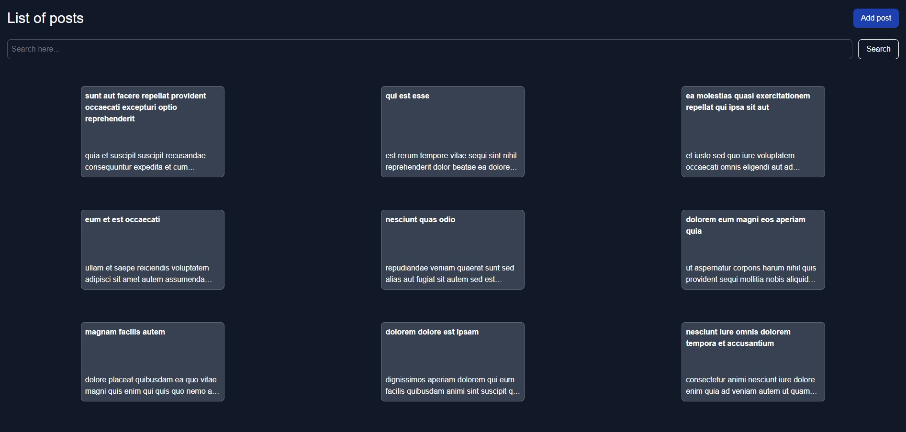

<div style="display:flex; align-items: center">
  <h1 style="position:relative; top: -6px" >Blog Post</h1>
</div>

---

### Screenshot



A platform to view, edit, and delete posts. There is also a search functionality.

The project uses jsonplaceholder for API.

#

### Table of Contents

- [Prerequisites](#prerequisites)
- [Tech Stack](#tech-stack)
- [Getting Started](#getting-started)

### Prerequisites

- _Node JS @20.X and up_
- _npm @10 and up_

#

### Tech Stack

- [React] - Front-end framework
- [Typescript] - JavaScript with syntax for types
- [@tanstack/react-query] - Handling API requests.
- [Tailwind CSS] - CSS framework
- [React Hook Form] - library for form validation

#

### Getting Started

1\. First of all you need to clone repository from github:

```sh
git clone https://github.com/datomaluta/blog-post
```

2\. Install all the dependencies

```sh
npm install
```

3\. after that you can run application from terminal:

```sh
npm run dev
```

#
